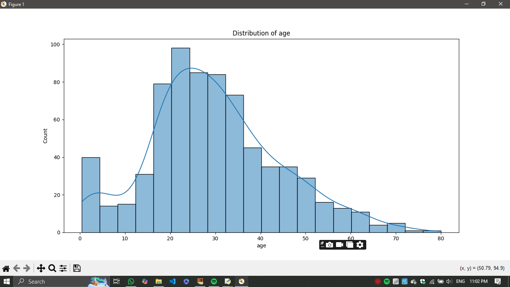

# CODETECH-TASK1
EXPLORATORY DATA ANALYSIS (EDA)
- **Name**: NITHYA SRI P R 
- **Company**: CODTECH IT SOLUTIONS  
- **ID**: CT08EPR  
- **Domain**: Data Analytics  
- **Duration**: December 2024 to January 2025  

# Exploratory Data Analysis (EDA)

This repository contains a Python script for performing Exploratory Data Analysis (EDA) on a given dataset. The script leverages popular libraries such as pandas, numpy, matplotlib, and seaborn to visualize and analyze the data effectively.

## Features

The EDA script provides the following functionalities:

1. **Dataset Loading**:
   - Reads the dataset from a CSV file.
   - Displays column names.

2. **Data Visualization**:
   - Histograms for visualizing data distribution.
   - Distribution plots for specific columns.
   - Scatter plots for visualizing relationships between two columns.
   - Pairplots to explore relationships between numerical columns.

3. **Correlation Analysis**:
   - Computes the correlation matrix for numerical columns.
   - Displays a heatmap of correlations.

4. **Outlier Detection**:
   - Boxplots for visualizing outliers in specific columns.
   - Outlier analysis using the Interquartile Range (IQR) method.

5. **Data Saving**:
   - Option to save the cleaned dataset as a new CSV file.
## Output

Below are the visualizations generated by the EDA script:

### Histogram Output

### Histogram - Specific Output

### Scatter Plot Output

###  Pairplot Output

### Heatmap Output

### Box Plot Output

